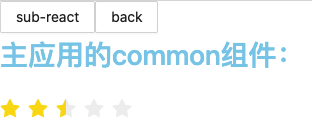
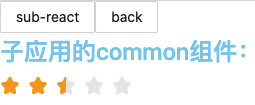

# qiankun-share-common

## 一、简介

公共文件 `common` 存放于 `main` 和 `sub` 的同级目录中，此时项目结构扁平。`main` 和 `sub` 的打包配置独立，`common` 的依赖由各自应用的依赖版本控制

## 二、运行

```shell
cd main && npm install && npm run dev
cd sub/app && npm install && npm run dev
```

## 三、运行结果

父子组件都用了 `common` 的 `Rate` 组件，`common` 的 `Rate` 组件则导出 `antd` 的 `Rate` 组件

由下图可知





主子应用虽然都用了 `common` 的代码，但是最终用的是自己 `node_modules` 的 `antd`。

## 四、实现步骤

### 1、将 common 目录在编译前拷贝到各个子应用中

这一步骤的原理如上所示，只需要在 `webpack` 构建前，将 `common` 目录拷贝到子应用的目录下，就能使用各子应用的依赖，但是这样的话，需要单独维护拷贝 `common` 的脚本文件，并且要实现`watch common`变化，在 `dev` 时能实时监听变化并同步到各目录中。总体实现较复杂。

问题的本质在于 `common` 找不到依赖，所以只要解决 `common` 不在子应用的问题即可。除了上述写 js 脚本的方法，还有两种充分利用 `npm` 软链接三方包特性的方法，实现较为简单。我们分别以 `main` 和 `sub` 为例，介绍这两种方法。

#### 方法一：使用本地包解决 main 的依赖问题

此方法利用了 `npm` 安装本地包时，会被自动 link 到 `node_modules` 中的特性。

实现如下：

首先要将 `common` 当做一个包，需要新建一份 `package.json`。然后在 `main` 的 `package.json` 中将其设置为本地包

```json
{
  "common": "file:../../common"
}
```

此时在 `main` 下运行 `npm install`，就会将 `common` 软链接到 `node_modules` 目录。

#### 方法二：使用 workspaces 解决 sub 的依赖问题

`npm` 在 7 以上支持使用 `workspaces` 。

此方法利用了 `workspaces` 中设置的三方包会被 `link` 到 `node_modules` 中的特性。

实现如下：

首先要将 `common` 当做一个包，需要新建一份 `package.json`。然后在 `sub` 的 `package.json` 中将其设置到 `workspaces` 中

```json
"workspaces": [
  "../common"
]
```

此时在 `sub` 下运行 `npm install`，就会将 `common` 软链接到 `node_modules` 目录。

### 2、修改 symlinks

`common` 现在已经成功以包的形式 `link` 到 `node_modules` 中，但是 `link` 过去后有个问题，`webpack` 在解析文件时，仍然用的是真实的路径，即 `project/common/Rate`，这样仍然找不到 `antd` 的依赖。所以还需要修改 `webpack` 解析的路径，需要将 `symlinks` 设置为 `false`。这样 `webpack` 解析时，就会以 `project/main/node_modules/common/Rate` 去解析，就能够找到 `main` 的 `antd` 依赖。

### 3、修改 loader

修改 `symlinks` 为 `false` `后，common` 的文件的路径会带上 `node_modules`，因此若 `babel-loader` 之前有配置`exclude: /node_modules/`，则会漏掉对组件的编译。因此，此时需要修改 exclude，改为`/node_modules([\\]+|\/)+(?!common)/`

### 4、watch common

可以充分利用 webpack-dev-server 的配置，将 dev-server 的 hot 设置为 true，或者设置 watch 的相关配置。
